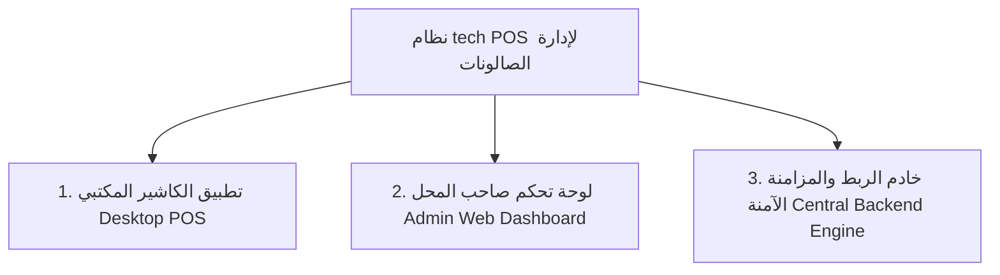

# 💈 دليل العرض التجاري والتسويقي لنظام (tech POS)
### الدليل الشامل لبيع وتسويق النظام لأصحاب صالونات ومحلات الحلاقة ومراكز التجميل

---

## 🎯 ملخص القيمة الفريدة (The Pitch Hook)
> **"نظام كاشير وإدارة متكامل يضمن لك عدم ضياع مليم واحد من إيرادات الصالون، يشتغل بدون إنترنت، يحسب نسب الحلاقين تلقائياً، ويمنحك تحكماً ومراقبة كاملة على هاتفك أينما كنت دون أن يرى الكاشير أرباحك الحقيقية."**

---

## 📦 المنتجات المتوفرة حالياً في النظام (جاهزة للتسليم فوراً)

---

### 1️⃣ تطبيق الكاشير المكتبي (Cashier Desktop App)
*تطبيق سريع للغاية، مخصص لشاشة البيع، مبني بأحدث تقنيات التطبيقات السريعة والمستقرة.*

* **العمل المستمر بدون إنترنت (Offline-First):** 
  - في حال انقطاع النت أو الكهرباء، الكاشير يعمل بكامل كفاءته دون أي توقف، ويتم تشفير البيانات محلياً وتخزينها في قاعدة بيانات مشفرة.
  - فور عودة الاتصال، تترحل جميع الفواتير والمقبوضات تلقائياً للسيرفر دون تدخل يدوي.
* **إدارة وتوزيع الحلاقين على الخدمات (Barber Line Assignment):**
  - إمكانية تعيين حلاق محدد لكل خدمة داخل الفاتورة الواحدة (مثال: حلاق للشعر وحلاق آخر للبشرة/الذقن)، لحساب عمولات كل موظف بدقة متناهية.
* **إدارة الورديات ومطابقة الخزينة (Shift Cash Balancing):**
  - تسجيل عهدة البداية (الكاش الافتتاحي).
  - تسجيل المصروفات النثرية أثناء اليوم وسحبها من الدرج مع توثيق السبب.
  - إغلاق الوردية بمطابقة الكاش المتوقع مقابل الكاش الفعلي (العد اليدوي) وكشف أي **عجز أو زيادة** مع إلزام الكاشير بتدوين سبب الفرق.
* **تعدد طرق الدفع والدفع المجزأ (Split Payments):**
  - سداد نقدي (Cash)، بطاقات بنكية (Card)، إنستاباي (InstaPay)، محفظة فودافون كاش / محافظ إلكترونية، أو تجزئة المبلغ على أكثر من طريقة في فاتورة واحدة مع حساب الباقي للعميل تلقائياً.
* **العروض والباقات المخفضة (Promotions & Packages):**
  - دعم باقات الخدمات المجمعة (مثل: باقة العريس / باقة VIP) بسعر ثابت مخفض وتطبيقها بضغطة زر.
* **إدارة الحجوزات والمواعيد (Appointments & Bookings):**
  - استقبال حجوزات العملاء وتحويل الحجز إلى فاتورة بيع مباشرة بضغطة زر دون إعادة إدخال الخدمات.
* **تعديل الأسعار والخصومات المقيدة:**
  - تطبيق خصم بقيمة ثابتة أو نسبة مئوية أو زيادة خاصة مع توثيق السبب للمراقبة.
* **طباعة الفواتير وتعدد التبويبات:**
  - العمل على أكثر من فاتورة مفتوحة في نفس الوقت والتبديل بينها بسلاسة مع إمكانية تعليق واستئناف الفواتير.

---

### 2️⃣ لوحة تحكم صاحب المحل (Owner Cloud Dashboard)
*لوحة ويب متجاوبة تفتح من أي جهاز (موبايل، تابلت، كمبيوتر) خاصة بالمالك فقط لمتابعة المحل لحظياً.*

* **شاشة المبيعات والفواتير المباشرة:**
  - مراقبة حية لجميع الفواتير المسددة، المبالغ، طرق السداد، مع فلاتر زمنية (اليوم، آخر 7 أيام، الشهر، أو مخصص).
* **سجل الورديات وحركات الخزينة:**
  - تقرير تفصيلي لكل وردية: متى فُتحت، متى أُغلقت، من الكاشير المسؤول، الكاش الفعلي، ونسبة العجز أو الزيادة وملاحظات الإغلاق.
* **تقارير أداء الحلاقين والعمولات (Staff Performance & Commissions):**
  - كشف حساب لكل حلاق: عدد الخدمات المنفذة، إجمالي إيراداته، ونسبته المستحقة بدقة تمنع أي خلافات مالية.
* **إدارة الكتالوج الشامل (Catalog Management):**
  - هيكلة المحل: **أقسام رئيسية** (مثل: العناية بالشعر، العناية بالبشرة، المساج، المشروبات والمنتجات) ⬅️ **مجموعات** ⬅️ **خدمات ومنتجات**.
  - تسعير مرن وتعديل فوري للخدمات والمنتجات مع اختيار الألوان والأيقونات لتسهيل استخدام الكاشير.
* **إدارة باقات العروض (Promotions Manager):**
  - إنشاء باقات محددة الخدمات بتاريخ بداية ونهاية وسعر ترويجي ثابت.
* **إدارة جدول المواعيد والحجوزات (Bookings & Calendar):**
  - استقبال الحجوزات، تعيين الموظف المفضل، وتحديد حالة الحجز (مؤكد، حضر، لم يحضر، ملغي).
* **دليل العملاء وسجل الزيارات (CRM):**
  - قاعدة بيانات كاملة للعملاء بأرقام هواتفهم، أعياد ميلادهم، وملاحظاتهم وتفضيلاتهم الخاصة وسجل زياراتهم ومشترياتهم السابقة.
* **إدارة المصروفات التشغيلية (Expense Tracker):**
  - تصنيف وتوثيق كافة المصروفات (فواتير كهرباء، إيجار، أدوات حلاقة، ضيافة، رواتب).
* **التقارير المالية والرسوم البيانية:**
  - رسوم بيانية تفاعلية لحجم المبيعات اليومية والشهرية، الخدمات الأكثر طلباً، وتوزيع طرق الدفع.
* **تصدير إكسل وتقارير محاسبية (Excel & CSV Export):**
  - تنزيل تقارير الفواتير، الورديات، والمصروفات بملفات Excel جاهزة للمحاسبة بضغطة زر.
* **سجل التدقيق الأمني (Audit Log):**
  - توثيق كل حركة حساسة في النظام (تسجيل الدخول، تعديل الأسعار، إلغاء الفواتير، تغيير الحلاقين) بالتاريخ والوقت والمستخدم.

---

## 🛡️ أقوى نقاط البيع والمزايا التنافسية (Competitive Advantages)

| المشكلة الشائعة في الصالونات | كيف يحلها نظامك؟ |
| :--- | :--- |
| **سرقة الكاش أو نسيان تسجيل المبالغ** | مطابقة إجبارية للخزينة بنهاية كل وردية، وتسجيل كل مليم كاش مقابل الخدمات المؤداة. |
| **انقطاع النت وتوقف حركة الصالون** | النظام Local-First يعمل 100% بدون إنترنت مع مزامنة سحابية تلقائية فور رجوع النت. |
| **خلافات الحلاقين على الحسابات والنسب** | تعيين الحلاق على كل خدمة داخل الفاتورة، واستخراج تقرير أداء وعمولات رقمي غير قابل للتلاعب. |
| **معرفة الكاشير لأرباح الصالون وسرية الحسابات** | عزل كامل للصلاحيات؛ الكاشير يرى فقط شاشة البيع، وتُمسح تفاصيل الورديات القديمة من جهازه بعد المزامنة لحماية الخصوصية. |
| **ضياع أرقام العملاء وتفضيلاتهم** | حفظ ملف متكامل لكل عميل برقم هاتفه وتاريخ زياراته مما يسهل إعادة استهدافه. |

---

## 💼 باقات التسعير المقترحة للبيع (Pricing Strategy)

### 🥇 الخيار الأول: اشتراك شهري / سنوي (SaaS Model) - *الأفضل لدخل مستمر*
* **الاشتراك السنوي:** `3,000 - 4,500 ج.م / سنوياً` (شامل الاستضافة، الدعم الفني، والمزامنة السحابية).
* **الاشتراك الشهري:** `350 - 450 ج.م / شهرياً`.

### 🥈 الخيار الثاني: بيع ترخيص مدى الحياة (Lifetime License)
* **السعر:** `6,000 - 8,500 ج.م` دفعة واحدة للمحل (شامل الإعداد والتثبيت لأول سنة، مع رسوم صيانة سنوية اختيارية).

### 🎁 عروض الهاردوير (Hardware Bundle) - *لرفع قيمة الصفقة*
* توفير النظام مع **طابعة فواتير حرارية (80mm/58mm) + درج كاش أوتوماتيكي + قارئ باركود** بسعر باقة شامل.

---

## 🚀 خطة النزول للسوق والإقناع (Sales Action Plan)

1. **الاستهداف المباشر (Direct Visits):**
   - زيارة صالونات الحلاقة المتوسطة والراقية ومراكز التجميل (Barbershops & Grooming Salons).
   - التحدث مباشرة مع **المالك (صاحب الصالون)** وليس الكاشير أو الحلاقين.
2. **العرض التجريبي الحي (Live 5-Minute Demo):**
   - اصطحاب لابتوب أو تابلت وعرض شاشة الكاشير السريعة وعملية فتح وردية وإصدار فاتورة وحساب نسبة حلاق في 30 ثانية.
3. **فترة تجربة مجانية (Free 7-Day Trial):**
   - تثبيت النظام للمحل لمدة أسبوع لتجربة مطابقة الخزينة وكشف الفروقات عملياً.
4. **خدمة ما بعد البيع:**
   - تدريب الكاشير وصاحب المحل في جلسة مدتها 30 دقيقة.
   - دعم فني سريع عبر الواتساب.
