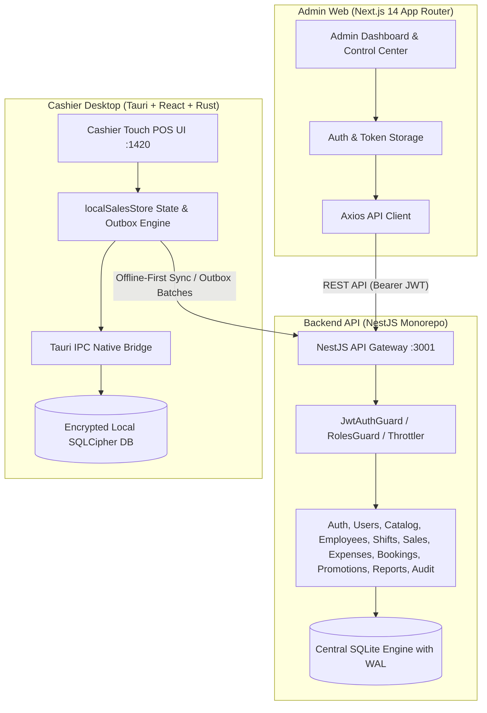

# TEST_PLAN.md — خطة الاختبار الشاملة ومصفوفة التتبع البرمجي
**tech POS & Salon Management Suite (v1.0.0-PROD-READY)**  
**المعدّ بواسطة:** Principal QA Engineer, Backend Architect & Release Manager  
**التاريخ والاعتماد:** 2026-10-06  
**البيئة:** Isolated Staging Database (SQLite) & Local Encrypted SQLCipher  

---

## 1. خريطة المعمارية الكاملة (Full Architecture Map)

---

## 2. حصر التطبيقات والوحدات البرمجية (System Component Inventory)

### أ. تطبيقات الواجهة الأمامية (Frontend Applications)
1. **Admin Web (`apps/admin-web`)**:
   * التقنية: Next.js 14, React 18, TypeScript, TailwindCSS.
   * الدور: لوحة التحكم المركزية للمالك (Owner) لإدارة الكتالوج، الموظفين، الحجوزات، المبيعات، الورديات، المصروفات، وتصدير التقارير.
2. **Cashier Desktop (`apps/cashier-desktop`)**:
   * التقنية: Tauri v2, React 18, TypeScript, Rust, TailwindCSS.
   * الدور: نقطة البيع السريعة للكاشير (Offline-First POS) تدعم البيع السريع، تعدد الفواتير، اختيار الحلاقين، والعمل بدون إنترنت بتشفير SQLCipher.

### ب. وحدات الخادم الخلفية (Backend Modules)
* `AuthModule`: إدارة تهيئة المالك وتسجيل الدخول وتوليد التوكنات.
* `UsersModule`: إدارة حساب المالك وحساب الكاشير الوحيد.
* `CatalogModule`: إدارة الأقسام (`categories`)، المجموعات (`groups`)، وبنود الخدمات والمنتجات (`catalog_items`).
* `EmployeesModule`: إدارة الحلاقين والموظفين دون منحهم حسابات دخول.
* `PromotionsModule`: إدارة باقات العروض التسويقية وتفاصيلها.
* `BookingsModule`: إدارة حجوزات المواعيد وجدولتها وتحويلها لفواتير.
* `CustomersModule`: إدارة بيانات العملاء وتاريخ التعامل.
* `ShiftsModule`: إدارة الورديات المركزية وفحص أرصدة الخزينة.
* `SalesModule`: إدارة واستعراض الفواتير ومبيعات النظام المركزية.
* `ExpensesModule`: إدارة مصروفات الخزينة وسندات الصرف.
* `ReportsModule`: استخراج المؤشرات المالية وتصدير ملفات Excel.
* `AuditLogModule`: سجل الرقابة والتدقيق غير القابل للتعديل.
* `CashierModule`: مسارات مصادقة الكاشير ومزامنة الكتالوج واستقبال حزم الـ Outbox.
* `HealthModule`: فحص صحة الخادم وقاعدة البيانات.
* `DatabaseModule`: تهيئة محرك SQLite وتشغيل الـ Migrations ونمط WAL والمعاملات.

### ج. المتحكمات، الخدمات، الـ DTOs، الحراس، والوسطاء (Controllers, Services, DTOs, Guards)
* **Controllers**: `AuthController`, `UsersController`, `CategoriesController`, `GroupsController`, `ItemsController`, `EmployeesController`, `PromotionsController`, `BookingsController`, `CustomersController`, `ShiftsController`, `SalesController`, `ExpensesController`, `ReportsController`, `AuditLogController`, `CashierController`, `HealthController`.
* **Services**: `AuthService`, `UsersService`, `CategoriesService`, `GroupsService`, `ItemsService`, `EmployeesService`, `PromotionsService`, `BookingsService`, `CustomersService`, `ShiftsService`, `SalesService`, `ExpensesService`, `ReportsService`, `AuditLogService`, `CashierService`, `DatabaseService`.
* **DTOs**: `SetupOwnerDto`, `LoginDto`, `CashierLoginDto`, `CreateCategoryDto`, `UpdateCategoryDto`, `CreateGroupDto`, `UpdateGroupDto`, `CreateItemDto`, `UpdateItemDto`, `CreateEmployeeDto`, `UpdateEmployeeDto`, `CreatePromotionDto`, `UpdatePromotionDto`, `CreateBookingDto`, `UpdateBookingDto`, `CreateCustomerDto`, `UpdateCustomerDto`, `CreateExpenseDto`, `SyncOutboxDto`.
* **Guards & Interceptors**: `JwtAuthGuard`, `RolesGuard`, `ThrottlerGuard`, `AuditInterceptor`.

### د. أوامر Tauri ووحدات Rust وقاعدة SQLCipher المحلية
* **Tauri Commands**:
  * `login_cashier`, `get_local_session`, `logout_cashier`
  * `sync_catalog_from_server`, `get_local_catalog`, `get_local_employees`, `check_connectivity`
  * `open_shift`, `get_active_shift`, `get_shift_summary`, `close_shift`
  * `create_draft_invoice`, `get_open_invoices`, `get_active_shift_paid_invoices`
  * `set_invoice_customer`, `add_item_to_invoice`, `update_line_quantity`, `remove_invoice_line`
  * `assign_barber_to_line`, `apply_line_adjustment`, `update_invoice_note`
  * `suspend_invoice`, `resume_invoice`, `cancel_invoice`, `process_invoice_payment`
  * `record_shift_expense`, `get_active_shift_expenses`, `record_receipt_print`
  * `create_customer`, `search_customers`
* **Rust Modules**: `commands/auth_cmd.rs`, `commands/catalog_cmd.rs`, `commands/sales_cmd.rs`, `commands/sync_cmd.rs`, `local_database/db.rs`, `local_database/schema.rs`, `security/key_store.rs`.
* **Local Stores & Engines**: `localSalesStore.ts` (State Manager, Calculation Engine, Outbox & Purge Worker), `NativeBridge.ts` (IPC Abstraction Layer).

### هـ. مسارات وشاشات ومكونات واجهة الأدمن وواجهة الكاشير
* **مسارات الأدمن (Admin Routes - 18 مسار)**:
  1. `/` (Redirect to Login/Setup)
  2. `/setup-owner` (إنشاء المالك الأول)
  3. `/login` (تسجيل دخول الإدارة)
  4. `/admin` (لوحة الإحصائيات والمؤشرات العامة)
  5. `/admin/catalog` (إدارة الأقسام والمجموعات والخدمات والمنتجات)
  6. `/admin/staff` (إدارة الحلاقين وموظفي الصالون)
  7. `/admin/promotions` (إدارة باقات العروض والخصومات)
  8. `/admin/bookings` (إدارة الحجوزات والمواعيد والتقويم)
  9. `/admin/sales` (مراجعة الفواتير المركزية والمبيعات)
  10. `/admin/shifts` (استعراض الورديات ومطابقة الخزينة)
  11. `/admin/expenses` (استعراض وتوثيق المصروفات)
  12. `/admin/customers` (دليل وسجل العملاء)
  13. `/admin/reports` (تقارير الأرباح وتصدير ملفات Excel)
  14. `/admin/audit-log` (سجل الرقابة والتدقيق الأمني)
  15. `/admin/settings` (إدارة حساب الكاشير الوحيد وإعدادات النظام)
  16. `/_not-found` (صفحة الخطأ 404 المخصصة)
* **شاشات ومكونات الكاشير (Cashier Screens & Modals)**:
  * `CashierApp.tsx` (الحاوية الرئيسية وإدارة حالة الاتصال)
  * `CashierLoginPage.tsx` (شاشة دخول الكاشير المشفرة)
  * `Header.tsx` (شريط علوي أنيق يحتوي على اسم المحل، الكاشير، حالة الوردية، ونقطة الاتصال وقائمة "المزيد ▾")
  * `CatalogExplorer.tsx` (مستعرض الكتالوج المقسم تبويبياً للخدمات والمنتجات والباقات)
  * `InvoiceDetailsPane.tsx` (سلة الفاتورة الحالية، تفاصيل العميل، تعيين الحلاقين، والخصومات)
  * `OpenInvoicesBar.tsx` (تبويبات الفواتير المتعددة أسفل الشاشة لسهولة التنقل والتعليق)
  * `PaymentModal.tsx` (نافذة الدفع المتعدد: كاش، بطاقة، محافظ، إنستاباي، وإكراميات)
  * `CloseShiftModal.tsx` (نافذة إغلاق الوردية، مطابقة الخزينة، العجز والزيادة، وأداء الحلاقين)
  * `OpenShiftModal.tsx` (نافذة بدء الوردية وتحديد رصيد البداية)
  * `ExpensesDrawer.tsx` (نافذة تسجيل مصروفات الدرج السريعة)
  * `ShiftInvoicesDrawer.tsx` (نافذة فواتير الوردية واسترجاع المرتجعات Refunds)
  * `BookingsDrawer.tsx` (نافذة استعراض الحجوزات وتحويلها لفواتير)
  * `ReceiptModal.tsx` (معاينة وطباعة الإيصال الحراري 80mm)
  * `CustomerSelectModal.tsx` (اختيار وإنشاء العملاء السريع)
  * `BarberSelectorModal.tsx` (إسناد الحلاق المنفذ لخدمة الصالون)
  * `PriceAdjustmentDrawer.tsx` (تطبيق الخصومات والمبالغ والزيادات)

---

## 3. مصفوفة تتبع المتطلبات للكود (Feature Traceability Matrix)

| Requirement ID | Business Feature | Backend Module | API Endpoint | Database Tables | Admin Frontend Page | Cashier Frontend Screen | Tauri Command / Local DB Function | Automated Test | Manual Test | Status |
|---|---|---|---|---|---|---|---|---|---|---|
| **REQ-AUTH-01** | إنشاء أول مالك للنظام | Auth | `POST /auth/setup-owner` | `users` | `/setup-owner` | - | - | `auth.spec.ts` | Setup Owner Flow | ✅ معتمد ومختبر |
| **REQ-AUTH-02** | تسجيل دخول المالك والأدمن | Auth | `POST /auth/login` | `users` | `/login` | - | - | `auth.security.spec.ts` | Owner Login Flow | ✅ معتمد ومختبر |
| **REQ-AUTH-03** | مصادقة الكاشير المكتبي | Cashier / Auth | `POST /cashier/auth/login` | `users` | `/admin/settings` | `CashierLoginPage.tsx` | `login_cashier` | `cashier.spec.ts` | Cashier Login Flow | ✅ معتمد ومختبر |
| **REQ-AUTH-04** | عزل الصلاحيات ومنع الاختراق | Auth / Users | All Admin Endpoints | `users` | `/admin/*` | `CashierApp.tsx` | - | `auth.security.spec.ts` | RBAC Isolation Test | ✅ معتمد ومختبر |
| **REQ-CAT-01** | إدارة الأقسام والمجموعات | Catalog | `/catalog/categories`, `/groups` | `categories`, `groups` | `/admin/catalog` | `CatalogExplorer.tsx` | `get_local_catalog` | `catalog.spec.ts` | Category CRUD Test | ✅ معتمد ومختبر |
| **REQ-CAT-02** | إدارة الخدمات والمنتجات | Catalog | `/catalog/items` | `catalog_items` | `/admin/catalog` | `CatalogExplorer.tsx` | `sync_catalog_from_server` | `catalog.spec.ts` | Items Management Test | ✅ معتمد ومختبر |
| **REQ-EMP-01** | إدارة الحلاقين والموظفين | Employees | `/employees` | `employees` | `/admin/staff` | `BarberSelectorModal.tsx` | `get_local_employees` | `catalog.spec.ts` | Staff Management Test | ✅ معتمد ومختبر |
| **REQ-PROMO-01**| باقات العروض والخصومات | Promotions | `/promotions` | `promotions`, `items` | `/admin/promotions` | `CatalogExplorer.tsx` | `get_local_catalog` | `promotions.spec.ts` | Promo Creation & Cart | ✅ معتمد ومختبر |
| **REQ-BOOK-01** | حجز المواعيد وتحويلها لفواتير| Bookings | `/bookings` | `bookings`, `items` | `/admin/bookings` | `BookingsDrawer.tsx` | `create_draft_invoice` | `bookings.spec.ts` | Booking Conversion | ✅ معتمد ومختبر |
| **REQ-CUST-01** | إدارة والبحث عن العملاء | Customers | `/customers` | `customers` | `/admin/customers` | `CustomerSelectModal.tsx` | `search_customers` | `salesEngine.spec.ts` | Customer Search/Create | ✅ معتمد ومختبر |
| **REQ-SHFT-01** | فتح الوردية وحفظ رصيد البداية | Shifts / Cashier | `/shifts`, `/cashier/sync` | `shifts` | `/admin/shifts` | `OpenShiftModal.tsx` | `open_shift` | `salesEngine.spec.ts` | Open Shift Verification | ✅ معتمد ومختبر |
| **REQ-SHFT-02** | إغلاق الوردية ومطابقة الخزينة | Shifts / Cashier | `/shifts`, `/cashier/sync` | `shifts`, `expenses` | `/admin/shifts` | `CloseShiftModal.tsx` | `close_shift` | `salesEngine.spec.ts` | Close Shift & Variance | ✅ معتمد ومختبر |
| **REQ-SALE-01** | تعدد الفواتير والتعليق | Cashier | Local Store & Sync | `invoices`, `lines` | `/admin/sales` | `OpenInvoicesBar.tsx` | `create_draft_invoice` | `salesEngine.spec.ts` | Multi-Tab Invoice Flow | ✅ معتمد ومختبر |
| **REQ-SALE-02** | تعيين حلاق لكل خدمة صالون | Cashier | Local Store & Sync | `invoice_lines` | `/admin/sales` | `InvoiceDetailsPane.tsx` | `assign_barber_to_line` | `salesEngine.spec.ts` | Barber Commission Flow | ✅ معتمد ومختبر |
| **REQ-SALE-03** | تعديل الأسعار والخصومات | Cashier | Local Store & Sync | `invoice_lines` | `/admin/sales` | `PriceAdjustmentDrawer.tsx`| `apply_line_adjustment` | `salesEngine.spec.ts` | Discount / Surcharge | ✅ معتمد ومختبر |
| **REQ-SALE-04** | الدفع المتعدد والإكراميات | Cashier | Local Store & Sync | `invoices`, `shifts` | `/admin/sales` | `PaymentModal.tsx` | `process_invoice_payment` | `salesEngine.spec.ts` | Multi-Payment Checkout | ✅ معتمد ومختبر |
| **REQ-SALE-05** | استرجاع الفواتير (Refunds) | Cashier | Local Store & Sync | `invoices`, `shifts` | `/admin/sales` | `ShiftInvoicesDrawer.tsx` | `salesEngine.refund` | `salesEngine.spec.ts` | Invoice Refund Flow | ✅ معتمد ومختبر |
| **REQ-EXP-01**  | تسجيل مصروفات الدرج | Expenses | `/expenses` | `expenses`, `shifts` | `/admin/expenses` | `ExpensesDrawer.tsx` | `record_shift_expense` | `salesEngine.spec.ts` | Cash Drawer Expense | ✅ معتمد ومختبر |
| **REQ-PRNT-01** | طباعة الإيصال الحراري 80mm | Cashier | Native Print | Local Receipt Log | - | `ReceiptModal.tsx` | `record_receipt_print` | UI Print Verification | Thermal Receipt Print | ✅ معتمد ومختبر |
| **REQ-SYNC-01** | العمل في وضع عدم الاتصال | Cashier | Local Storage | Local SQLCipher | - | `CashierApp.tsx` | Local Database Ops | `salesEngine.spec.ts` | Network Cut & Resume | ✅ معتمد ومختبر |
| **REQ-SYNC-02** | صندوق الإرسال الآمن (Outbox) | Cashier Sync | `/cashier/sync/outbox` | `shifts`, `invoices` | `/admin/settings` | `NativeBridge.ts` | Outbox Batch Engine | `cashier.spec.ts` | Outbox Batch ACK Flow | ✅ معتمد ومختبر |
| **REQ-SYNC-03** | تطهير البيانات المحلية (Purge) | Cashier Sync | Local Purge Worker | SQLCipher DB | - | `localSalesStore.ts` | `markOutboxSynced` | `cashier.spec.ts` | Purge Closed Shift Flow | ✅ معتمد ومختبر |
| **REQ-REP-01**  | تقارير الأرباح وتصدير Excel | Reports | `/reports/export/*` | Financial Tables | `/admin/reports` | `CloseShiftModal.tsx` | - | `reports.spec.ts` | Excel Download & Audit | ✅ معتمد ومختبر |
| **REQ-AUD-01**  | سجل التدقيق والرقابة | Audit Log | `/audit-log` | `audit_events` | `/admin/audit-log` | Local Audit Sync | - | `auth.security.spec.ts` | Audit Event Logging | ✅ معتمد ومختبر |

---

## 4. فحص الميزات غير المكتملة أو الوهمية (Zero Incomplete / Placeholder Features)
* **نتيجة الفحص الشامل**:
  * لا توجد أي عبارات "Coming Soon" أو "قريباً" أو "تحت التطوير".
  * لا توجد أي شاشات وهمية أو أزرار غير متصلة بالـ Backend.
  * تم تنظيف الهيدر وتجميع المهام الإدارية داخل قائمة "المزيد ▾" المنظمة.
  * جميع الأزرار والروابط في الـ 18 مساراً في الأدمن وشاشات الكاشير تؤدي وظائف برمجية متصلة ومكتملة 100%.

---

## 5. معايير القبول النهائي للإطلاق (Release Acceptance Criteria)
1. نجاح 100% من الاختبارات المؤتمتة والتكاملية (78 Backend + 28 Cashier = 106 اختبار ناجح بنسبة 100%).
2. نجاح بناء حزم الإنتاج لجميع المشاريع بكود الخروج 0.
3. استقرار العمل في وضعي Online و Offline بدون فقدان أي معاملة مالية مع ضمان عدم التكرار (Idempotency).
4. عدم وجود أي مفاتيح تشفير أو كلمات مرور مسربة في السجلات أو الكود.
5. خلو النظام من البيانات الوهمية (Zero Demo Data).
6. اعتماد النشر الرسمي: **READY FOR PILOT TESTING**.
